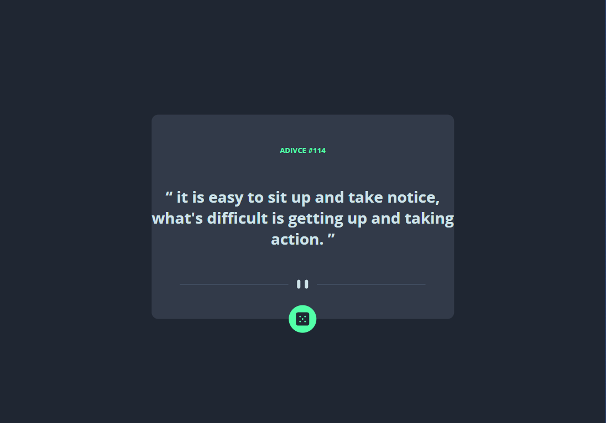
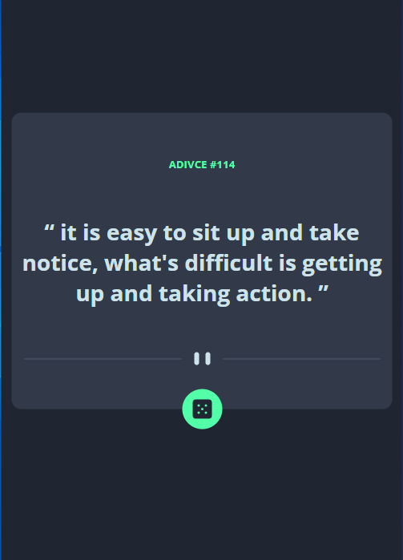

# Frontend Mentor - Advice generator app

This is a solution to the [Advice generator app challenge on Frontend Mentor]
Frontend Mentor challenges help you improve your coding skills by building realistic projects.

## Overview

### Screenshot

### Links

- Solution URL: [repo](https://github.com/youssefa111/Frontend-Mentor---Advice-generator-app)
- Live Site URL: [live page](https://youssefa111.github.io/Frontend-Mentor---Advice-generator-app/)

### Built with

- Semantic HTML5 markup
- CSS custom properties
- javascript

### Continued development

Javascript - typescript - angular.js
